# Capstone Project - Azure Machine Learning Engineer 

In this project, a dataset i.e. bank note authentication has been used and fed to Azure ML services. Two approaches are taken on the dataset and they are as follows. 

* Automated ML: AutoML is an automation way to deal with time consuming tasks of machine learning model. As a result, it selects the best model after running through multiple algorithms. It saves time and resource. 

* Hyperdrive: Hyperdrive helps tune hyperparameters for the model. In this case, we need to select algorithm and hyperparameters to be tuned. 

As mentioned, two experiments are in ML studio.

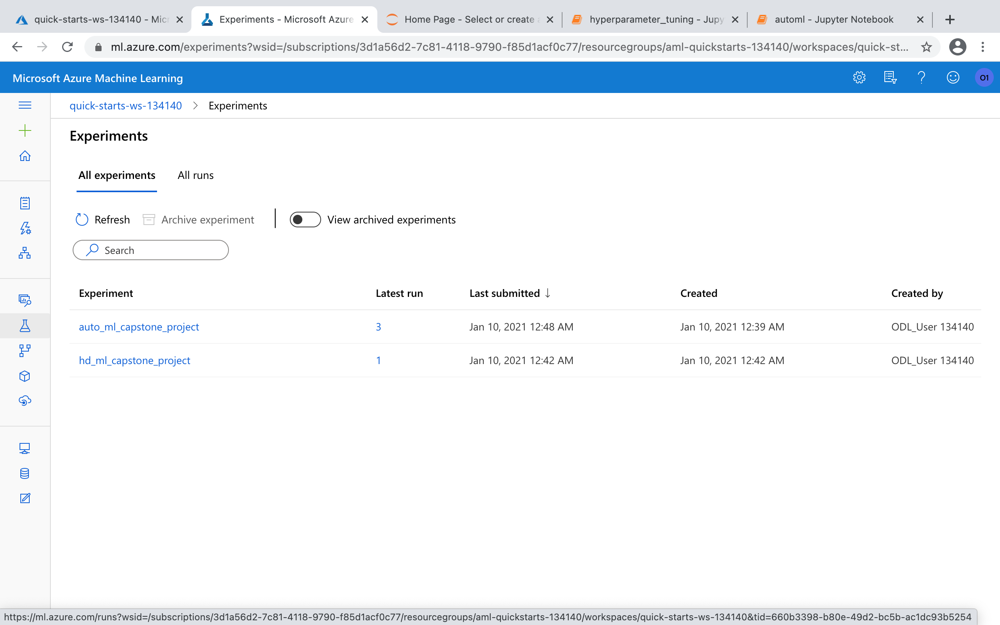

## Project Set Up and Installation

In order to run notebooks in this project, the following needs to be met. 

* Access Microsoft Azure Portal.
* Create workspace in Azure ML Studio.
* Create a VM to run Jupyter Notebook.
* Register dataset that can be accessed from notebook.

## Dataset

### Overview

Data were extracted from images that were taken from genuine and forged banknote-like specimens. For digitization, an industrial camera usually used for print inspection. The final images have 400x 400 pixels. Due to the object lens and distance to the investigated object gray-scale pictures with a resolution of about 660 dpi were gained. Wavelet Transform tool were used to extract features from images.

1. variance of Wavelet Transformed image (continuous) 
2. skewness of Wavelet Transformed image (continuous) 
3. curtosis of Wavelet Transformed image (continuous) 
4. entropy of image (continuous) 
5. class (integer i.e. 0/1) 

Source: dataset and above note are from [UCI](https://archive.ics.uci.edu/ml/datasets/banknote+authentication).

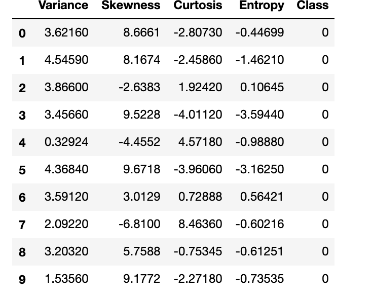

### Task

It is a classification problem to find out whether the bank note is genuine or forged.

### Access

I have downloaded dataset from UCI repository and registered the same in ML studio as tabular data. The following screenshot shows dataset registration.

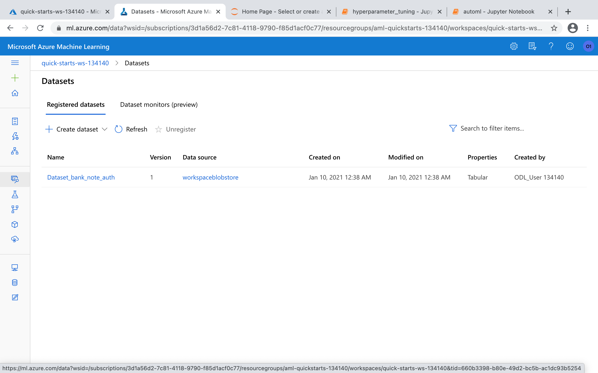

After dataset being available in ML studio, it can easily accessed from Jupyter Notebook.

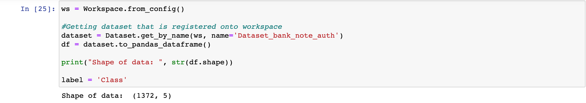

## Automated ML

Automated machine learning, also referred to as automated ML or AutoML, is the process of automating the time consuming, iterative tasks of machine learning model development. It allows data scientists, analysts, and developers to build ML models with high scale, efficiency, and productivity all while sustaining model quality. Automated ML in Azure Machine Learning is based on a breakthrough from our Microsoft Research division. 

[Source](https://docs.microsoft.com/en-us/azure/machine-learning/concept-automated-ml)

Here are configuration used in AutoML experiment.

* experiment_timeout_minutes = 15 (This depicts total time to be taken by all iterations before it terminates.)
* max_concurrent_iterations = 3 (It represents maximum number of parallel execution.)
* enable_early_stopping = True (It helps terminate execution if score is not improving in the short term.)
* task = classification (This is type of execution to solve the problem.)
* primary_metric = accuracy (Accuracy being chosen which will help choose the best model selection.)
* training_data = train_data (This is train data i.e. bank note authentication.)
* label_column_name = label (The name of the label column.)
* n_cross_validations = 5 (Number of cross validation to be performed.)
* compute_target = aml_compute (Experiment to be run on compute.)

### Results

AutoML has yielded the highest accuracy i.e. 1.0 with **StackEnsemble** algorithm. 

**StackEnsemble**

Ensemble machine learning methods use multiple learning algorithms to obtain better predictive performance than could be obtained from any of the constituent learning algorithms. Many of the popular modern machine learning algorithms are actually ensembles. For example, Random Forest and Gradient Boosting Machine (GBM) are both ensemble learners. [Source](https://docs.h2o.ai/h2o/latest-stable/h2o-docs/data-science/stacked-ensembles.html)

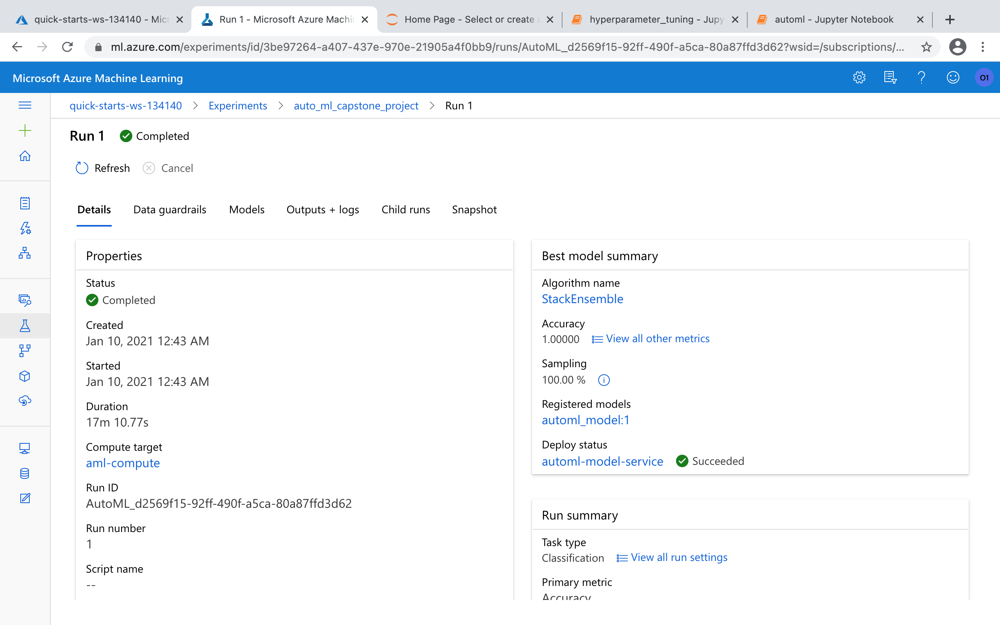

AutoML has considered a good number of algorithms before declaring StackEnsemble as the best one. Here is a screenshot of **RunDetails**.

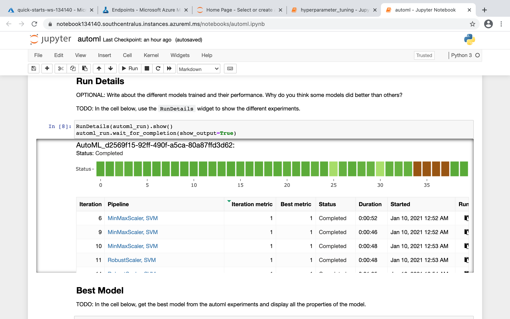

We can take a look at the parameters of StackEnsemble. 

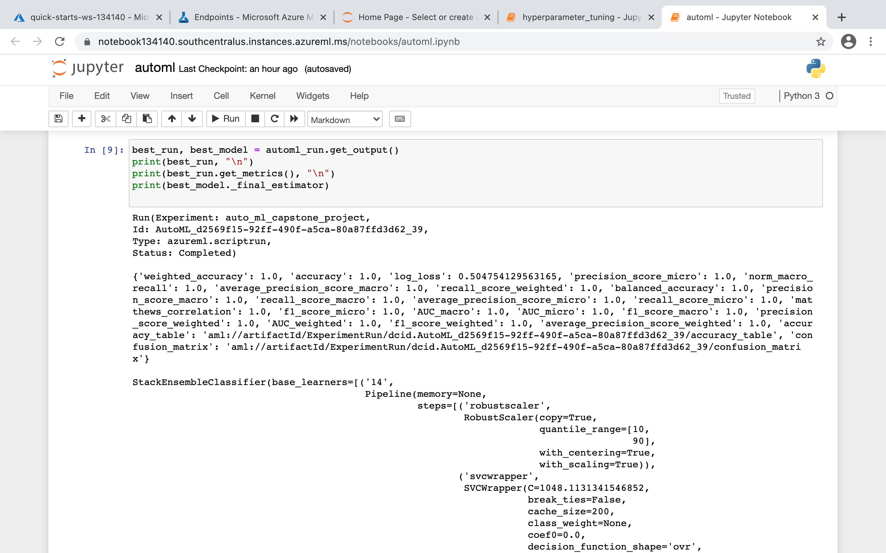

Hyperparameters are as follows:

- C=1048.1131341546852,
- break_ties=False,
- cache_size=200,
- class_weight=None,
- coef0=0.0,
- decision_function_shape='ovr',
- degree=3,
- gamma='scale',
- kernel='rbf',

Detailed view is here.

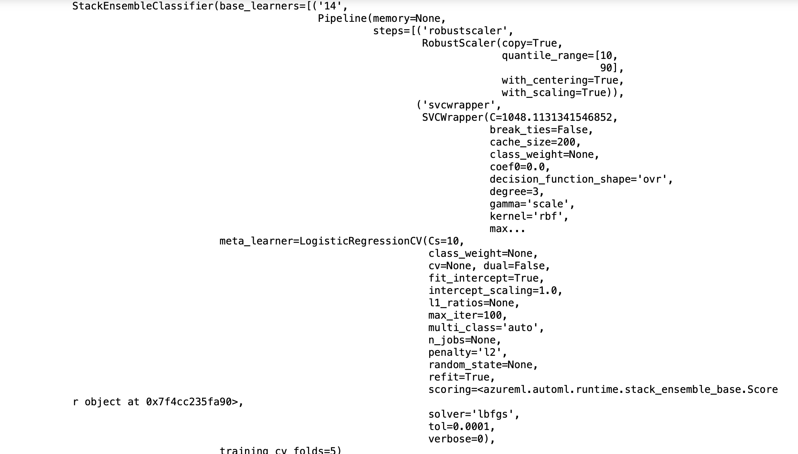

## Hyperparameter Tuning

This is a classification problem, and I have made use of Logistic Regression for this task. Two parameters are tuned, and they are as follows.

* C: is the inverse of the regularization term (1/lambda). It tells the model how much large parameters are penalized, smaller values result in larger penalization. We can think of regularization as adding (or increasing the) bias if our model suffers from (high) variance (i.e., it overfits the training data). On the other hand, too much bias will result in underfitting (a characteristic indicator of high bias is that the model shows a "bad" performance for both the training and test dataset).

* max_iter: is the maximum iteration to converge.

Search spaces of both hyperparameters:

`param_sampling = RandomParameterSampling(
                                {
                                    "--C": uniform(0.1,1), "--max_iter": choice(75,100,125,150)
                                }
                            )
`

**Termination policy:** 

I have used here bandit policy. It terminates runs where the primary metric is not within the specified slack factor/slack amount compared to the best performing run. It saves computation time.

Configuration settings: 

 * estimator: An estimator is called with sampled hyperparameters.
 * policy: Bandit policy is configured here. 
 * primary_metric_name : Name of metric for which runs will be evaluated.
 * primary_metric_goal: It determines whether primary metric will be maximized or minimized.
 * max_total_runs: The maximum total number of runs to create.
 * max_concurrent_runs: The maximum number of runs to execute concurrently.
 
 [Parmeter explanation](https://docs.microsoft.com/en-us/python/api/azureml-train-core/azureml.train.hyperdrive.hyperdriveconfig?view=azure-ml-py)

### Results

This experiment has gained an accuracy of **0.9927** having tuned two parameters such as Regularization Strength(0.22) and Max Iterations(125).

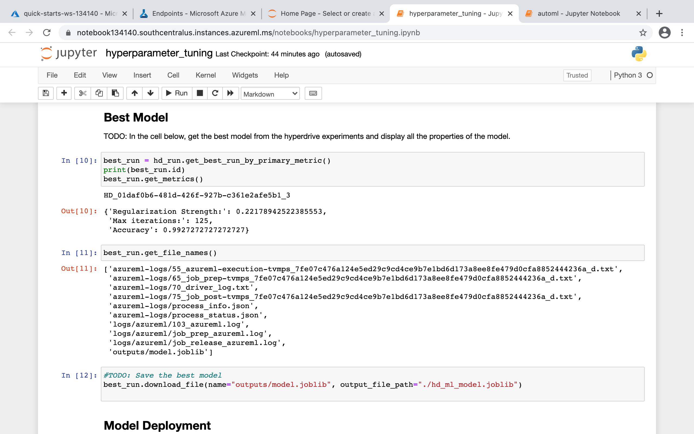

View of RunDetails. 

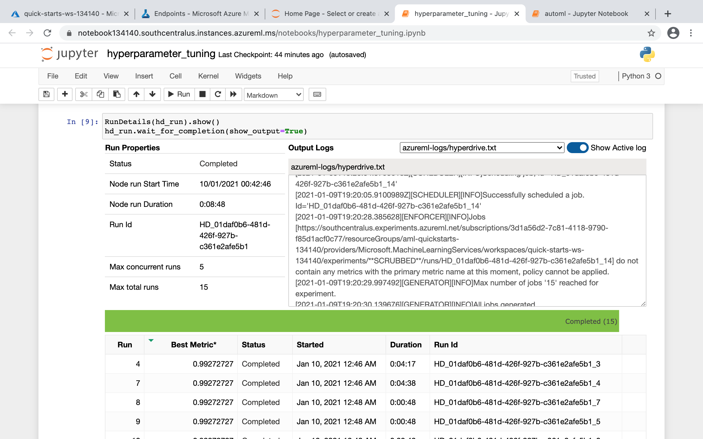

View of experiment in ML studio.

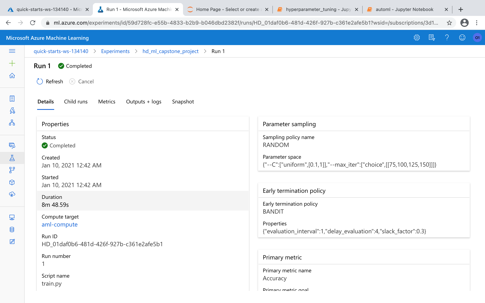

## Model Deployment

The best models from both experiments have been registered in workspace of ML studio. 

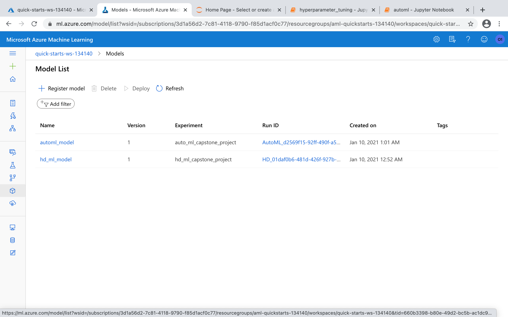

However, AutoML experiment gives better accuracy (**1.00**) than that of Hyperdrive experiment, and I have deployed the model generated by the same experiment. The deployed model provides REST API which can be accessed by HTTP methods.

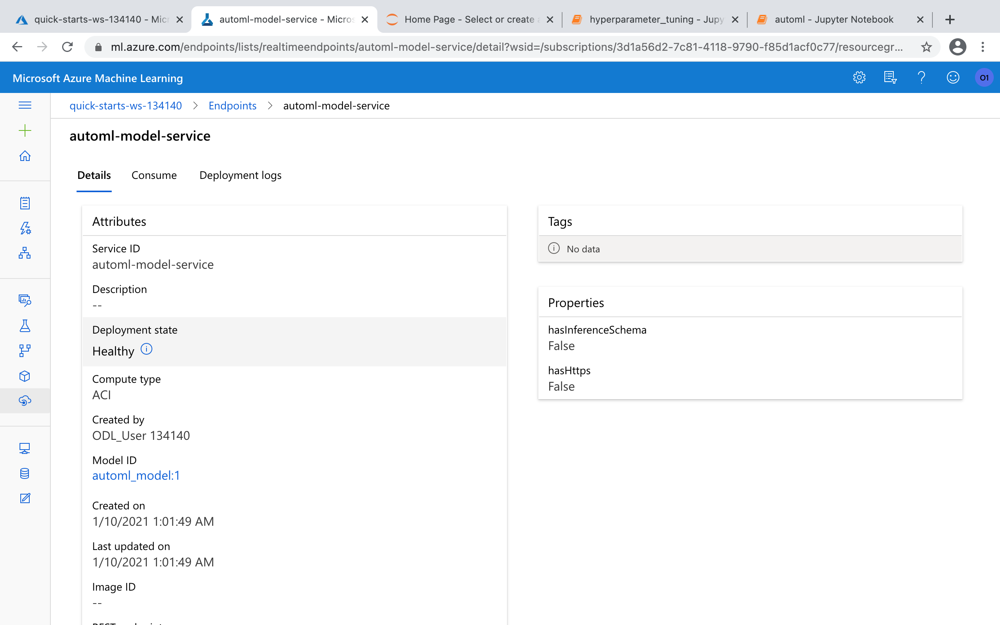

After model deployment, REST API can be queried with sample input, and prediction as a result will be returned.

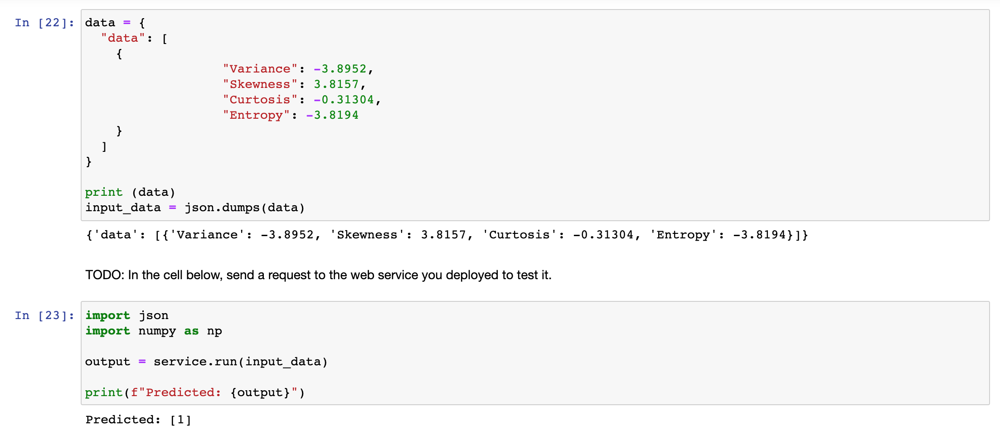

Screenshot of service logs which is most helpful in case of troubleshooting.

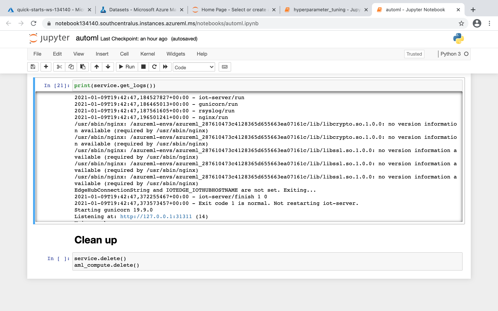

## Screen Recording
Screenshot of experiment demonstration and model deployment is [here](https://youtu.be/YIkD2cgshjc).

## Standout Suggestions
1. I could have taken large dataset for these experiment.
2. We would like to use other primary metrics because accuracy sometimes does not help derive model performance.
3. In experiment with HyperDrive, we could use Bayesian sampling in place of Random sampling for Hyperparameter selection. Bayesian sampling is based on the Bayesian optimization algorithm. It picks samples based on how previous samples performed, so that new samples improve the primary metric.
4. We could use warm start which enables to reuse knowledge of previous runs accelerating hyperparameter tuning in HyperDrive experiment. [Source] (https://docs.microsoft.com/en-us/azure/machine-learning/how-to-tune-hyperparameters)

## Citation
1. GitHub
2. Microsoft documents
3. StackOverflow
4. UCI repository
